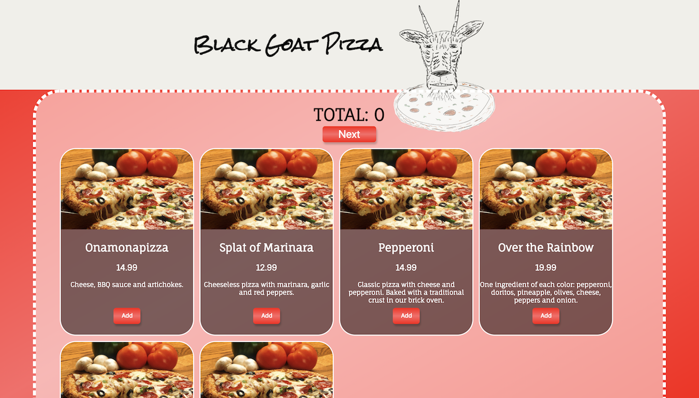

# Black Goat Pizza

An application that simulates a pizza parlor's online ordering and admin view.

## Built With

- React
- Redux
- MongoDB
- Node.js
- Express

## Getting Started

To get this project running, fork and clone this repo onto your local machine.

1. run `mongod` in the terminal
2. open the project folder in terminal and run the following command:

**Import data**

```
mongoimport --db pizza_parlor --collection pizzas --file pizza.csv --type csv --headerline
```
3. `npm install`
4. `npm run server`
5. `npm run client`

Remember, Mongo creates the database and collections automatically! There is no need to do any additional database work after importing the pizzas. Use `cmd` + `r` in Robo 3T to refresh your list of databases. `pizza_parlor` should now appear in that list.

**Start your server**

```
npm install
npm run server
```

## Screen Shot



###Completed Features

- [x] Add or remove pizzas from order
- [x] Enter customer info
- [x] Review and confirm order
- [x] View all orders placed on admin page

###Next Steps

- [ ] Allow users to navigate back before submitting order
- [ ] Display a list of pizzas ordered on admin page
- [ ] Add more pictures of pizzas

##Authors

- Julia Balliet
- Justin Spitzley
- Jesse Remington
- Abbey Janicek
- Dan MacKay
- Anthony James
 
